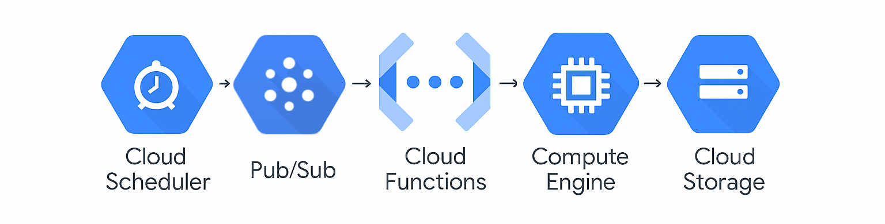

# Automated UTR Scraper

## Overview

This automated scraper collects historical match data from the Universal Tennis Rating (UTR) platform for professional tennis players. The primary goal is to gather comprehensive match history and performance data that will be used to train and optimize a tennis match prediction model.

## Implementation on Google Cloud Platform

The scraper is fully automated on Google Cloud Platform that minimizes costs by only running when needed and automatically shutting down after completion.



### Process Flow

1. **Cloud Scheduler Cron Job triggers PubSub Topic**
   - Scheduled to run once a week, on Tuesdays at midnight (best time relative to utr updates after matches)
   - Uses cron expression format for precise scheduling
   - PubSub serves as an asynchronous intermediary 
      - The PubSub service's only job is to tell the Cloud Function to run and doesn't care about the execution of the script. This allows for future integration where match completion triggers a new scrape (ie. handling many requests to scrape instead of just the one)
 

2. **Cloud Function runs script to start Compute Engine VM**
   - [cloud_function_trigger.py](https://github.com/dom-schulz/utr-tennis-match-predictor/blob/main/automated-utr-scraper/cloud_function_trigger.py) contains the Cloud Function code
   - Allows for retry logic and monitoring of trigger events

3. **VM (running on Compute Engine) spins up container to run scraper**
   - [startup-script.sh](https://github.com/dom-schulz/utr-tennis-match-predictor/blob/main/automated-utr-scraper/startup-script.sh) initializes the environment and runs the container
   - [Dockerfile](https://github.com/dom-schulz/utr-tennis-match-predictor/blob/main/automated-utr-scraper/Dockerfile) defines the container environment
   - Compute Engine used instead of Cloud Run/Cloud Functions due to the long-run time of the scraping process (2+ hours)
   - Docker provides consistent environment management for local and cloud testing

4. **Scraper writes to Google Cloud Storage Bucket**
   - Scraping and data processing run within the Docker container
   - Results are saved as a CSV file to a Google Cloud Storage bucket
   - Structured logs are also written to GCS for debugging and monitoring

5. **VM shuts down automatically**
   - [startup-script.sh](https://github.com/dom-schulz/utr-tennis-match-predictor/blob/main/automated-utr-scraper/startup-script.sh) includes a monitoring section that watches for container completion
   - VM automatically terminates after successful completion of scraping, minimizing compute costs
   - Safety timeout ensures shutdown even in error cases after 5 hours

## Core Files

[`scrape_history_gcp.py`](https://github.com/dom-schulz/utr-tennis-match-predictor/blob/main/automated-utr-scraper/scrape_history_gcp.py)

The "main" file of the scraper that orchestrates the entire process. It:
- Initializes logging and configuration
- Sets up connections to Google Cloud Storage
- Coordinates the scraping processes
- Includes extensive logging for debugging and future troubleshooting
- Manages error handling and retry logic

[`scraper.py`](https://github.com/dom-schulz/utr-tennis-match-predictor/blob/main/automated-utr-scraper/scraper.py)

Contains the core scraping functions and functionality:
- Originally received from a classmate (approximately 85% unchanged)
- Modified to run in a containerized environment on GCP
- Added `get_chrome_options()` to configure Chromedriver options for Docker
- Includes functions to navigate UTR website and extract match data
- Handles data extraction from the UTR profile pages

[`startup-script.sh`](https://github.com/dom-schulz/utr-tennis-match-predictor/blob/main/automated-utr-scraper/statup-script.sh)

Runs when the VM starts and:
- Installs necessary dependencies
- Pulls the latest Docker image
- Starts the container with required environment variables
- Monitors container execution and logs
- Handles the auto-shutdown logic to terminate the VM after completion
- See [startup_script_README.md](https://github.com/dom-schulz/utr-tennis-match-predictor/blob/main/automated-utr-scraper/startup_script_README.md) for more detailed documentation

[`Dockerfile`](https://github.com/dom-schulz/utr-tennis-match-predictor/blob/main/automated-utr-scraper/Dockerfile)

Defines the container environment:
- Based on the Selenium standalone Chrome image (prebuilt docker image for these packages)
- Installs Python and required libraries
- Sets up the scraper code within the container
- Configures environment variables and entry points (i.e., `CMD ["python", "scrape_history_gcp.py"]`)
- Creates a reproducible environment for consistent execution during local and cloud testing

[`cloudbuild.yaml`](https://github.com/dom-schulz/utr-tennis-match-predictor/blob/main/automated-utr-scraper/cloudbuild.yaml)

Automates the Docker image build process:
- Connected to GitHub repository for continuous deployment
- Automatically builds a new Docker image whenever changes are committed
- Pushes the image to Google Artifact Registry
- Ensures the scraper always runs with the latest code

[`profile_id.csv`](https://github.com/dom-schulz/utr-tennis-match-predictor/blob/main/automated-utr-scraper/profile_id.csv)

Contains the list of UTR profile IDs to scrape:
- Each row represents a tennis player to be processed
- The scraper iterates through these profiles to collect match data

`credentials.json`(not in repository)
- Used for local testing with Google Cloud services
- Contains service account credentials for GCP authentication
- Excluded from git repository via `.gitignore` for security
- On the cloud, credentials are managed through GCP's built-in authentication


## Secrets/Credentials Handling

This project leverages Google Cloud's built-in security features:
- Service accounts with appropriate IAM permissions
- Secrets are managed through GCP Secret Manager
- No credentials are hardcoded in the source code

## Challenges and Solutions

This project presented several significant technical challenges that required extensive research and experimentation to overcome:

### Learning Google Cloud Platform
- Had to self-learn multiple Google Cloud services and their interactions without prior experience
- Worked extensively with documentation and leveraged AI tools to understand concepts
- Troubleshooting errors across connected services required developing a better understanding of GCP as a whole
- Navigated service permissions, networking, and resource management
- Developed a mental model of how different cloud services interact to create a cohesive system

### Docker Implementation
- This was my first experience working with Docker which required understanding the distinction between images and containers and how they interact
- Modifying `scraper.py` to run headless (without a display) within a container required significant time
- Testing locally before deployment helped identify environment-specific issues early
- Docker's consistency between local and cloud environments ultimately was very helpful (once understood)

### Google Cloud Logging and Debugging
- Tracking errors across five different GCP services required learning multiple logging interfaces (for debugging)
- Had to SSH into the Compute Engine VM frequently to read error logs and debug issues on the cloud
- Implemented structured logging in the application code to make logs more helpful

### Secret Management
- Implementing different credential handling strategies for local vs. cloud environments was time consuming
      - Local testing required mounting credentials to the Docker container, while cloud deployment used service accounts
- Ensuring sensitive information was never committed to Git required careful management of environment variables
- Learned to leverage GCP's built-in security services for managing sensitive credentials


## Future Scraper Enhancements

### Serverless Architecture
- Migrate from VM-based scraping to serverless Cloud Functions to process individual player data (ie. scrape for one player at a time via a Cloud Function for each)
- This would eliminate the need for Compute Engine and remove the runtime constraint 
- Would require redesigning the scraper to process single profiles efficiently

### Data Processing Pipeline
- Implement a more sophisticated data processing pipeline using Dataflow or Cloud Functions
- Integrate with BigQuery for more advanced query and analytics capabilities

### Cost Optimization
- Analyze and optimize cloud resource usage to reduce operational costs
- Implement more specific scheduling based on tournament calendars
- Consider regional pricing differences when deploying resources

### Continuous Integration Improvements
- Expand test coverage for the scraper components
- Implement automated end-to-end testing in CI/CD pipeline
- Add performance benchmarks to catch regressions
- Create development, staging, and production environments for safer deployments

## Helpful Docker Commands for Local Testing

1. Navigate to desired local directory
```bash
cd path/to/automated-utr-scraper
```

2. Build Docker image
```bash
docker build -t your-image:latest .
```

3. Run container
```bash
docker run -d --name utr-scraper \
  -e UTR_EMAIL="your_email@gmail.com" \
  -e UTR_PASSWORD="your_password" \
  -e GCS_BUCKET_NAME="your_bucket" \
  -e GOOGLE_CLOUD_PROJECT="your_project" \
  -e GOOGLE_APPLICATION_CREDENTIALS="/app/credentials.json" \
  your-image:latest
```

**Note:** To recreate this scraper, you need a UTR account with a "Power Subscription" to access the detailed match history data. 